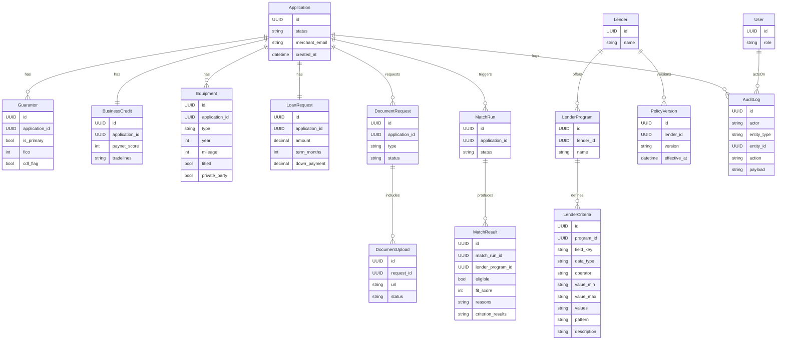
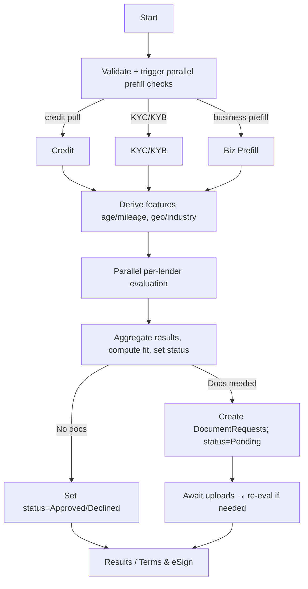

# Implementation Plan

## 1. Tech Stack
- Frontend: React + TypeScript + Vite + Tailwind; deploy to Vercel.
- Backend: Python + FastAPI; Hatchet for orchestrated workflows (parallel lender eval, retries); deploy to Heroku.
- DB: PostgreSQL (Heroku Postgres); SQLAlchemy + Alembic for migrations.
- Auth/roles: simple role flag (broker vs. underwriter/admin) handled in API; stub for future SSO.
- Docs/tests: pytest for backend; React Testing Library for critical UI; README/DECISIONS already planned.
- Integrations (stubs/pluggable): credit pull (TU/Experian partner), KYC/KYB (Alloy/Persona/Trulioo), business prefill (Clearbit/ZoomInfo/Places), VIN/equipment lookup, Plaid/statement upload for cash-flow, eSign (DocuSign/HelloSign).
- Mocking third-party vendors: dedicated mock server (FastAPI router) or WireMock/MSW-style handlers to simulate KYC, KYB, business prefill, credit check, and bank verification responses for local/dev and tests.

## 2. Project Structure
- `frontend/`: Vite React app, routes: `/apply`, `/applications/:id`, `/applications`, `/lenders`, `/lenders/new`, `/lenders/:id`.
- Auth split: merchant pre-auth link flow for `/apply`; underwriter login for back office routes (`/applications`, `/lenders`, etc.).
- `backend/`: FastAPI app with modules:
  - `models/` (SQLAlchemy): Application, Guarantor, BusinessCredit, Equipment, LoanRequest, Lender, LenderProgram, LenderCriteria, MatchRun, MatchResult, PolicyVersion, AuditLog, DocumentRequest, DocumentUpload.
  - `schemas/` (Pydantic): request/response DTOs.
  - `services/`: matching engine, scoring, policy registry, feature derivation, document request handling, audit logger.
  - `workflows/`: Hatchet DAGs for validation → feature derivation → per-lender evaluation (parallel) → aggregation → status update; retry configs.
  - `api/`: routers for applications, lenders, matching runs, documents, audit log.
  - `db.py`, `settings.py` for config.
- `shared/`: enums (states, industries, equipment classes, application statuses, document types).
- `scripts/`: seed sample lender policies from PDFs (manual config).
- `docs/`: UML/class diagrams for core models and workflows.
 - Criteria/rules: LenderCriteria to store typed rules (e.g., operator, field_key, data_type, operands) supporting range/int, in/not_in, contains, boolean checks so new data points and rules can be added without code changes.

## 3. Phase Breakdown
### Phase 1 — Repo Setup & Scaffolding
Tasks:
- Initialize backend FastAPI project; add Poetry/requirements; configure settings/env for Heroku Postgres.
- Add SQLAlchemy + Alembic; create base models and shared enums; bootstrap lint/test config.
- Initialize frontend Vite + React + TS + Tailwind; basic layout and routing skeleton.
- Add docs folder with initial UML/class diagram scaffold.
- Add mock server scaffolding/routes for third-party vendors (credit/KYC/KYB/biz prefill/bank verification) with configurable fixtures.

### Phase 2 — Data Modeling & Persistence
Tasks:
- Implement DB models and migrations for application domain: Application, Guarantor (primary flag), BusinessCredit, Equipment, LoanRequest, DocumentRequest/Upload, AuditLog.
- Implement models for lender registry: Lender, LenderProgram, LenderCriteria (normalized fields), PolicyVersion.
- Implement MatchRun/MatchResult tables with per-criterion evaluation details.
- Seed script for manual lender configs derived from PDFs.

### Phase 3 — Matching Engine & Workflows
Tasks:
- Implement feature derivation (equipment age/mileage bands, geography/industry flags, startup vs established).
- Implement rule evaluation per lender/program (eligibility + reasons) and fit scoring (weighted: required floors > collateral > geo/industry > financial depth).
- Integrate Hatchet workflow: validate → derive features → parallel per-lender eval → aggregate → persist results/status; add retry/backoff.
- Add real-time/parallel third-party checks: trigger credit + KYC/KYB + business prefill as guarantor/business info is entered; surface partial results and handle timeouts/fallbacks.
- Add audit logging hooks for all actions (applications, policy edits, workflow steps).
- Add dynamic rule engine layer that interprets LenderCriteria operators by data type (range/in/not_in/contains/boolean) so new fields and rules can be introduced via config.
- Wire the mock server into the workflow toggle for local/dev to simulate vendor responses and error cases; add fixtures for pass/fail/timeout paths.

### Phase 4 — API Surface
Tasks:
- CRUD endpoints: applications (with submit), lenders/policies (manual add/edit; versioned), document requests/uploads (metadata), audit log retrieval.
- Underwriting run initiation and status retrieval; match results retrieval with per-criterion reasoning.
- Role guard (broker vs underwriter/admin) at route level (simple header/env stub).
- Prefill/third-party endpoints or webhooks to reflect status of parallel checks; expose partial results to frontend.

### Phase 5 — Frontend UX
Tasks:
- Merchant flows: application form with prefill indicators, review/submit; status/detail with doc request list and upload; results view with per-lender pass/fail and reasons; terms review/eSign stub.
- Underwriter console: applications list/detail with re-run control, document request UI, match reasoning; lender policy list/detail/edit; add new lender form (manual config).
- Shared components: match cards, audit trail timeline, policy criteria table/editor, prefill badges, validation/error toasts.
- Auth UX: pre-auth link entry for merchants; login form/session handling for underwriters.

### Phase 6 — Tests, Docs, Deployment Prep
Tasks:
- Backend tests: feature derivation, rule evaluation (happy/edge), fit scoring, workflow path statuses.
- Frontend tests: critical form validation and results rendering.
- Update README with setup/run/deploy; DECISIONS with prioritizations/simplifications; Heroku/Vercel deploy notes.
- Provide sample data and curl/Postman examples.
- Publish UML/class diagram in `docs/` and link from README/DECISIONS.

## 4. Testing Strategy
- Backend: pytest; unit tests for rule evaluation and scoring; service tests for workflow steps; use SQLite/pg in CI.
- Frontend: React Testing Library for form validation and match result rendering.
- Seeded fixtures for lender policies and sample applications to assert eligibility paths.
- Manual smoke: submit sample app → run workflow → verify statuses and results; underwriter edits policy → re-run match.

## 5. Deployment Strategy
- Backend: Heroku (Procfile + Gunicorn/Uvicorn); env vars for DB and Hatchet; run Alembic migrations on release.
- Frontend: Vercel build from `frontend/`; configure API base URL env.
- Database: Heroku Postgres; apply migrations via release phase.
- Observability: basic logging to stdout; audit logs persisted in DB.

## 6. ERD & Workflow (Mermaid)
- ERD (store in `docs/erd.mmd`; excerpt):

- Workflow (store in `docs/workflow.mmd`; excerpt):

